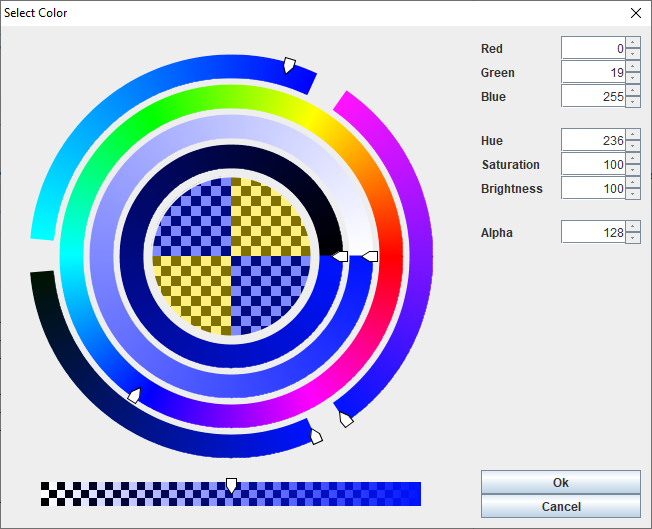

# Radial Color Dialog #




## A Radial Color Dialog for Java Swing ##

This is a color picker for Java Swing with radially aligned sliders.  This color picker concept was originally born of OpenGL tests and then re-implemented in Java Swing for use in some personal projects.  This is presented as an alternative to the standard Java Color Chooser.  


## Notes ##
This isn't the most efficient algorithm, it seemed to perform well enough in testing.  It draws the color bands by painting short rays of varying color and then masks the edges.  A more efficient way of painting the color bands will be looked at in the future.

## Usage ##
This operates as any other Java Swing JDialog.  

```java
  //init without JFrame owner for demo [null]
  RadialColorDialog rcd = new RadialColorDialog(null);
  //color to edit
  Color editColor = new Color(255,0,128,128);
  //show the dialog
  boolean ok = rcd.showDialog(editColor, "Select Color");
  //check result
  if(ok) {
     Color color = rcd.getColor();
  } 
  //dispose
  rcd.dispose();
```

### License ###
Released under the MIT License, 2020.


